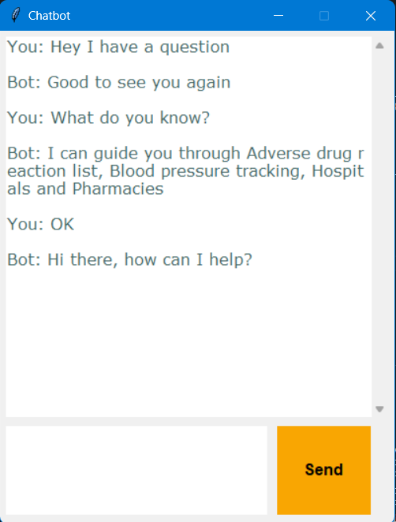

# Simple Chatbot
For a chatbot to understand a user query, it is helpful to break the query into an intent and entity. 

### Example
Consider the question: "Hi, what do you know today?"
An example of the intent would be `get_knowledge` and the entity would be `today`. 

### Method
We first train a machine learning model to understand the entities and intents, and use this to build a reasonable response to simple questions.

## Result GUI
